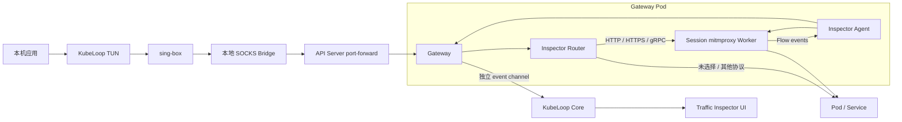

# Gateway Traffic Inspector 设计

> 状态：提案
> 范围：HTTP/1.1、HTTPS、HTTP/2、gRPC
> 目标版本：待定

## 1. 背景

KubeLoop 当前将工作站访问 Kubernetes Pod、Service 和集群 DNS 的流量通过以下路径送入集群：

```text
本机应用
  → TUN
  → sing-box
  → 本地 SOCKS Bridge
  → Kubernetes API Server port-forward
  → Gateway
  → Pod / Service
```

Gateway 收到 TCP open 请求后解析目标地址，在集群内直接连接目标并执行双向字节复制。该位置
已经具备原始目标、集群网络可达性和完整双向流，因此适合插入应用层流量检查能力。

本方案新增可选的 Gateway Traffic Inspector，用于查看 HTTP、HTTPS 和 gRPC 请求。其他协议、
未选择的目标以及 UDP 流量保持当前直接转发路径。

## 2. 设计结论

本方案采用：

1. **Inspector 位于 Gateway 层**，不在工作站额外创建 TUN 或透明代理。
2. **mitmproxy 作为可替换的 Inspector Engine**，由独立 Inspector Agent sidecar 托管。
3. **每个桌面 Session 使用隔离的 Inspector worker 和短期 Intermediate CA**。
4. **Gateway 根据 Session、目标 IP 和端口显式选择 Inspector**，不自动接管全部集群流量。
5. **其他 TCP/UDP 协议默认直接转发**，不经过 mitmproxy。
6. **Flow 事件使用独立事件通道返回桌面**，不得阻塞 Gateway 数据面或现有 control channel。
7. **第一阶段只读观察**，不提供修改、Mock、阻断或重放。

不采用“本机 sing-box → mitmproxy → 原 SOCKS Bridge”的直接链式方案，原因是：

- mitmproxy upstream mode 只支持 HTTP/HTTPS upstream，不支持 SOCKS upstream；
- mitmproxy 直接连接 ClusterIP 会再次进入 KubeLoop TUN，产生回环；
- 需要额外的 HTTP CONNECT → SOCKS 适配器；
- 本机进程、证书、特权和跨平台生命周期更复杂；
- Gateway 已经天然位于目标连接建立点。

## 3. 目标

1. 支持本机经 TUN 访问集群时的 HTTP/1.1、HTTPS、HTTP/2 和 gRPC 流量检查。
2. 展示请求、响应、headers、trailers、状态、耗时和有限大小的 body。
3. 支持 gRPC Unary、Server Streaming、Client Streaming 和 Bidirectional Streaming。
4. 支持使用 Protobuf descriptor 展示 gRPC message 字段。
5. 未启用 Inspector 时保持当前数据路径和性能特征。
6. Inspector 故障不得影响未选择的 Service、端口、其他协议或 UDP。
7. 支持共享 Gateway 中多个桌面用户的严格 Session 隔离。
8. Root CA 私钥不得离开工作站。
9. 流量事件和敏感 body 不默认落盘。
10. Gateway 和 Inspector Agent 保持无特权、无 ServiceAccount token、只读根文件系统。

## 4. 非目标

第一阶段不包含：

- 通用 PCAP 抓包或 Wireshark 集成；
- SSH、数据库、Redis、Kafka、MQTT、AMQP 等协议解析；
- HTTP/3、QUIC 或其他 UDP 应用层解析；
- 绕过 Certificate Pinning；
- 绕过或模拟未知客户端身份的 mTLS；
- 修改请求或响应；
- Mock、断点、重放、主动扫描；
- 全局公网代理；
- 永久保存 Gateway 侧请求记录；
- 将共享 Gateway CA 安装到所有用户工作站；
- 使用 Inspector 替换现有 Exchange 或 Mirror 语义。

## 5. 当前约束

### 5.1 Gateway 是共享单副本

Gateway Deployment 当前固定为一个副本，一个集群内的多个 KubeLoop 用户可能连接同一个 Pod。
Inspector 配置、CA、Flow 和目标列表不能做成 Gateway 全局状态。

### 5.2 KCG1 outbound 没有 Session 身份

当前普通 TCP/UDP open 请求只携带：

```text
command + target host + target port
```

它不能关联到某个 control session。反向 Exchange/Mirror listener 已经持有 control session，
但普通 TUN outbound 没有该关联。

因此启用 Inspector 前必须扩展 tunnel 协议，为 control、outbound、accept 和 event 连接增加
Session Token。

### 5.3 Gateway 当前是纯 L4 relay

Gateway 不解析 HTTP/TLS，只负责：

```text
resolve private target → net.Dial → bidirectional copy
```

Inspector 必须保持可选，不能让 HTTP 依赖进入所有连接的基础路径。

### 5.4 本机只路由集群网段

sing-box 只将发现到的 Pod CIDR、Service CIDR、精确 Service IP 和集群域名送入
`kubernetes-out`。公网与无关私网流量继续使用 `direct-out`，不会到达 Gateway Inspector。

## 6. 总体架构



组件职责：

| 组件 | 职责 |
| --- | --- |
| KubeLoop Core | Session、目标配置、CA 生命周期、事件缓存、脱敏策略和 UI API |
| Privileged Helper | 只负责将 Root CA 安装或移出系统信任库 |
| sing-box | 保持现有 TUN 和集群路由，不理解 Inspector |
| SOCKS Bridge | 保持现有 Gateway tunnel 适配，不理解 HTTP |
| Gateway | Session 鉴权、目标匹配、直连/Inspector 分流、事件转发和故障隔离 |
| Inspector Agent | Session worker 生命周期、资源限制、Unix Socket API 和健康状态 |
| mitmproxy worker | HTTP/TLS/HTTP2/gRPC 代理、动态证书和 Flow 解析 |
| UI | 目标选择、请求列表、详情、过滤、清空和导出 |

## 7. 数据路径

### 7.1 未启用 Inspector

路径与当前实现完全一致：

```text
TUN → sing-box → SOCKS Bridge → Gateway → Target
```

不启动 worker，不生成 Intermediate CA，不创建事件通道。

### 7.2 已选择 HTTP/HTTPS/gRPC 目标

```text
TUN
  → sing-box
  → SOCKS Bridge
  → Gateway(session token, target)
  → Session mitmproxy SOCKS5 listener
  → Target
```

Gateway 作为 SOCKS5 client，把原始目标交给 worker。worker 在集群内部直接连接目标，因此
不会重新进入工作站 TUN。

### 7.3 其他协议

| 流量 | 路径 |
| --- | --- |
| 未选择的 TCP | Gateway 直接连接 |
| 已选择端口但显式模式为 passthrough | Gateway 直接连接 |
| 未识别 TCP | Gateway 直接连接 |
| UDP / DNS | 当前 Gateway UDP relay |
| HTTP/3 / QUIC | UDP 直通 |
| SSH / DB / Redis / Kafka / MQTT | TCP 直通 |
| 无法安全解密的 TLS | 按 Target Policy 直通或明确失败 |

不把未知协议发送给 mitmproxy 的 raw TCP 模式。虽然可以透明转发，但没有应用层收益，却增加
延迟、资源和故障依赖。

### 7.4 反向 Service Intercept

第一阶段只覆盖工作站通过 TUN 发起的 outbound 连接。

第二阶段可在 Gateway `interceptListener` 接收集群客户端连接后，使用 listener 所属
control session 的 Inspector Policy，将流量送入相同 worker。该路径适用于观察集群内客户端
访问 Exchange/Mirror Service 的请求。

第二阶段不得改变 Mirror 的 Primary/Shadow 语义；Inspector 位于 Primary 主路径前，Mirror
仍由现有 Mirror Engine 决定是否复制本机 Shadow。worker 的 upstream 必须使用 Mirror
已经保存的原始 Pod `primaryAddrs`，不能重新连接被改写后的 Service ClusterIP，否则流量会
再次回到 Gateway listener 形成循环。

## 8. Target Policy

用户必须显式选择 Service 端口。概念数据结构：

```go
type InspectorTarget struct {
    ID          string
    Context     string
    Namespace   string
    Service     string
    ServiceUID  string
    Addresses   []string
    Port        uint16
    Mode        InspectorMode
    CaptureBody bool
    MaxBodySize int64
    Redaction   RedactionPolicy
}

type InspectorMode string

const (
    InspectorHTTP        InspectorMode = "http"
    InspectorHTTPS       InspectorMode = "https"
    InspectorGRPC        InspectorMode = "grpc"
    InspectorAuto        InspectorMode = "auto"
    InspectorPassthrough InspectorMode = "passthrough"
)
```

Gateway 的实际匹配键为：

```text
session token + destination address + destination port
```

Namespace、Service、UID 用于防止 Service 重建后的错误恢复和 UI 展示。Service ClusterIP、
ExternalName 和 Headless Service 需要分别规范化：

- ClusterIP Service：匹配 ClusterIP + port；
- ExternalName：匹配规范化域名 + port；
- Headless Service：第一阶段不自动展开 Endpoint，用户可选择具体 Pod IP；
- Service 重建导致 UID 或 ClusterIP 变化：暂停 Policy，要求刷新。

## 9. 协议识别

### 9.1 显式优先

用户或 Service port `appProtocol` 提供的显式模式优先于自动识别：

- `http`：HTTP/1.x 或 h2c；
- `https`：TLS 内的 HTTP/1.x 或 HTTP/2；
- `grpc`：gRPC over h2c 或 TLS；
- `auto`：使用前导字节与 TLS ALPN；
- `passthrough`：不检查。

### 9.2 自动识别

Gateway 只读取一个有界 peek buffer，不消费或丢失客户端字节：

| 特征 | 识别结果 |
| --- | --- |
| HTTP method + request line | HTTP/1.x |
| `PRI * HTTP/2.0\r\n\r\nSM\r\n\r\n` | h2c |
| TLS record + ClientHello | TLS |
| 其他 | passthrough |

TLS ClientHello 可获得 SNI 和 ALPN。`h2` 只表示 HTTP/2，是否为 gRPC必须在解密后检查
`content-type: application/grpc`。

peek 有严格大小和时间上限。超时或不确定时默认 passthrough。

## 10. gRPC 模型

### 10.1 Flow

每次 gRPC RPC 对应一个 Flow：

```text
authority
service/method path
request metadata
response headers
request messages[]
response messages[]
trailers
grpc-status
grpc-message
start/end/duration
```

### 10.2 Message framing

不能假设一个 HTTP/2 DATA frame 对应一条 gRPC message。worker 必须按流维护缓冲并解析：

```text
1 byte   compressed flag
4 bytes  message length, big-endian
N bytes  protobuf payload
```

需要支持 message 跨多个 DATA frame，以及一个 DATA frame 包含多条 message。

### 10.3 Protobuf descriptor

解析顺序：

1. 用户为 Target 上传的 FileDescriptorSet；
2. 可选 gRPC Server Reflection；
3. 无 descriptor 时展示原始 message 大小、压缩标记和 Base64/Hex。

descriptor 只属于当前 Context/Service Policy，不在 Gateway 长期持久化。

### 10.4 Streaming

Unary 与四类 streaming RPC 使用统一事件模型：

```text
FlowStarted
RequestMessage(sequence)
ResponseHeaders
ResponseMessage(sequence)
Trailers
FlowEnded
```

不能等待完整 RPC 结束后一次性上传 body。长连接必须增量发送 message，并受事件背压策略控制。

## 11. Session 隔离与 tunnel v2

### 11.1 Session Token

桌面每次 Connect 生成 32-byte 随机 Session Token，仅保存在内存。它用于关联：

- control connection；
- outbound TCP/UDP open；
- reverse accept；
- Inspector event connection；
- Gateway 内的 Target Policy；
- Inspector Agent worker。

Token 经 API Server port-forward 传输，不写日志、不进入持久化、不返回 UI。

### 11.2 KCG2

引入 tunnel v2 magic：

```text
K C G 2
command
session token
command payload
```

Gateway 在过渡期同时接受：

- KCG1：保持现有功能，但不提供 Inspector；
- KCG2：验证 active control session token，允许 Inspector。

KCG2 control handshake 返回 capability：

```json
{
  "inspector": true,
  "protocols": ["http", "https", "http2", "grpc"],
  "maxBodySize": 1048576,
  "maxTargets": 128,
  "engine": "mitmproxy"
}
```

当管理员预装的 Gateway 版本不支持 Inspector 时，桌面显示 capability unavailable，不自动
降级为不安全的全局模式。

### 11.3 控制消息

新增 Session-scoped 控制操作：

```text
InspectorStart
InspectorUpdateTargets
InspectorStop
InspectorStatus
InspectorRotateIntermediateCA
```

control channel 只传配置、状态和 ACK，不承载 Flow body。

### 11.4 Event connection

新增独立 `CommandInspectorEvents` 连接。事件使用有界、版本化 frame：

```text
length | version | event type | flow ID | sequence | JSON payload
```

第一阶段允许 body 使用 Base64，但必须受单 body 和 Session 总量限制。后续可以增加 raw binary
chunk frame，不能破坏 v1 event decoder。

## 12. Inspector Agent

Gateway 镜像增加可选 sidecar：

```text
gateway container
inspector-agent container
shared emptyDir (medium=Memory)
```

Agent 只监听共享 Unix Socket，不监听 Pod IP。职责：

1. 验证来自 Gateway 的 Session 操作；
2. 为 Session 创建独立 worker、监听端口和临时目录；
3. 安装 Session Intermediate CA；
4. 启动和健康检查 mitmdump；
5. 将 addon event 标记 Session 后发送给 Gateway；
6. enforce CPU、内存、body、Flow 和 worker 数量限制；
7. control 断开或 idle timeout 后清理；
8. 不把请求内容写到容器磁盘。

每个 Session 使用独立 worker，避免共享：

- CA 和私钥；
- Target Policy；
- mitmproxy option；
- Flow cache；
- addon 状态；
- 用户请求内容。

Agent 必须配置最大并发 worker 数。达到上限时拒绝新的 Inspector Session，但 Gateway 的直接
转发继续工作。

### 12.1 Engine 抽象

Gateway 不依赖 mitmproxy 私有协议。Agent API 使用稳定的内部契约：

```go
type InspectorEngine interface {
    StartSession(context.Context, SessionConfig) (Endpoint, error)
    UpdateTargets(context.Context, string, []InspectorTarget) error
    StopSession(context.Context, string) error
    Events(string) <-chan FlowEvent
}
```

未来可替换为 Go 原生 HTTP/2/gRPC engine 或其他代理，而不修改 tunnel、UI 和 Gateway policy。

## 13. CA 生命周期

### 13.1 Root CA

首次启用 HTTPS Inspector 时：

1. 桌面生成 KubeLoop Inspector Root CA；
2. Root CA 私钥保存到 OS 安全存储；
3. Privileged Helper 只将 Root CA 公钥证书安装到系统信任库；
4. UI 显示指纹、有效期和安装状态。

Root CA 私钥不得发送到 Gateway。

### 13.2 Intermediate CA

每次 Connect/Inspector Session：

1. 桌面生成短期 Intermediate key pair；
2. Root CA 签发 Intermediate CA；
3. Intermediate 有效期默认不超过 24 小时；
4. 通过 KCG2 control channel 发送 Intermediate cert、key 和 chain；
5. Agent 只保存在 memory-backed volume；
6. Session 结束立即删除。

mitmproxy 使用 Intermediate CA 动态签发目标 leaf certificate。客户端只需长期信任 Root CA。

### 13.3 卸载和轮换

- 用户可以单独禁用 Inspector，而不卸载 Root CA；
- 用户可以从 Settings 删除 Root CA 信任并清除本地 key；
- Root CA 到期前提示轮换；
- Intermediate 到期、Gateway 重启或 control 恢复失败时自动停止 Inspector；
- 任何 CA 操作不得静默执行；
- 日志只能记录证书指纹，不能记录 private key 或完整 PEM。

### 13.4 mTLS 和 Pinning

- Certificate Pinning：标记为 `tls-pinning-or-untrusted-ca`，允许用户切换 passthrough；
- mTLS：只有用户显式提供该 Target 的客户端证书时才支持；
- 不复制 kubeconfig client certificate 作为应用 mTLS certificate；
- 不提供绕过 Pinning 的功能。

## 14. Flow 数据模型

```go
type FlowSummary struct {
    ID            string
    SessionID     string
    TargetID      string
    Protocol      string
    HTTPVersion   string
    Method        string
    Authority     string
    Path          string
    StatusCode    int
    GRPCStatus    string
    StartedAt     time.Time
    Duration      time.Duration
    RequestBytes  int64
    ResponseBytes int64
    Truncated     bool
    Error         string
}
```

详情按需关联：

```text
RequestHeaders
RequestBody
ResponseHeaders
ResponseBody
Trailers
GRPCMessages[]
TLS metadata
Timing breakdown
```

TLS metadata 只展示：

- SNI；
- ALPN；
- TLS version；
- cipher；
- leaf subject/issuer/expiry；
- upstream verification result。

不展示或保存会话密钥。

## 15. 隐私、脱敏和存储

默认脱敏：

- `Authorization`；
- `Proxy-Authorization`；
- `Cookie` / `Set-Cookie`；
- Kubernetes bearer token；
- 常见 API key headers；
- URL 中配置的敏感 query 参数；
- gRPC metadata 中的 `*-bin` 和 authorization。

默认策略：

| 项目 | 默认值 |
| --- | --- |
| Gateway 持久化 | 禁止 |
| 桌面持久化 | 禁止 |
| 内存 Flow 数量 | 500 |
| Session 内存上限 | 50 MiB |
| 单 request/response body | 1 MiB |
| 单 gRPC message | 1 MiB |
| 超限处理 | 保留 metadata，标记 truncated |
| HAR/JSON 导出 | 用户显式操作 |

导出前再次提示可能包含敏感数据。清空和断开连接应立即释放内存 body。

## 16. 背压与性能

原则：**Inspector 事件不得阻塞业务数据面。**

每个 Session 使用有界事件队列。压力过高时按顺序降级：

1. 停止保存新的 body chunk；
2. 保留 headers、trailers、status、timing 和错误；
3. 对 streaming message 采样；
4. 最后丢弃完整 Flow，并增加 dropped counter。

不得因为 UI 未打开、事件连接断开或桌面消费过慢而阻塞 mitmproxy → Target 的转发。

目标开销：

| 路径 | 目标 |
| --- | --- |
| Inspector 未启用 | 与当前路径无可测差异 |
| 未选择目标 | 不进入 sidecar |
| HTTP headers-only | P95 额外延迟 < 5 ms（不含 TLS） |
| 最大 worker 空闲内存 | 在实现验证后确定并形成硬限制 |

body 捕获、Protobuf decode 和 UI 序列化必须设置独立预算。

## 17. 故障策略

### 17.1 Fail-open 边界

只有在尚未把任何客户端字节交给 worker 时可以 fail-open：

- Agent 不可用；
- worker 启动失败；
- SOCKS listener 建连失败；
- Policy 尚未 ready。

Gateway 记录警告后直接连接 Target。

### 17.2 Fail-closed 边界

一旦客户端字节已经交给 worker，就不能在同一连接上安全回退，因为 TLS 和 HTTP 状态已被消费。
此时关闭连接并返回明确错误，后续新连接可以根据健康状态直接旁路。

### 17.3 Control 和 Gateway 恢复

- control connection 丢失：立即停止该 Session worker 并删除 Intermediate key；
- control redial 成功：重新发送 Policy 和新的 Intermediate CA；
- Gateway Pod 重启：桌面检测 capability，重新建立 Inspector Session；
- event channel 丢失：继续转发但停止 body 捕获，尝试有界重连；
- Agent crash：Gateway 标记 unhealthy，新连接 fail-open，已有连接自然失败。

## 18. 安全边界

1. Inspector 默认关闭。
2. 只允许 Session Token 所属 control channel 配置和读取该 Session。
3. Agent Unix Socket 不绑定网络接口。
4. Gateway 和 Agent 均 non-root、drop all capabilities、禁止 privilege escalation。
5. CA 临时目录使用 memory-backed `emptyDir`。
6. Intermediate key 不记录、不持久化、不进入 Kubernetes Secret。
7. Gateway 只允许连接 private cluster target，沿用现有 `resolvePrivate` 限制。
8. Target Policy 必须匹配当前 Context inventory，不能借 Inspector 绕过目标范围校验。
9. body 和 headers 在 Gateway/Agent 日志中禁止输出。
10. Inspector capability 不得绕过 Kubernetes RBAC；Gateway 仍只通过 API Server port-forward 访问。

## 19. UI 方案

新增 `Traffic Inspector` 页面：

```text
┌ Targets ──────────────┐ ┌ Flows ───────────────────────────────┐
│ default/orders :443 ✓ │ │ POST /orders.Create  gRPC  OK  23ms │
│ default/api    :8080 ✓│ │ GET  /health         200      4ms  │
│ default/redis  :6379 -│ │ ...                              │
└───────────────────────┘ └───────────────────────────────────────┘
                         ┌ Detail ────────────────────────────────┐
                         │ Headers | Body | Messages | Timing | TLS│
                         └─────────────────────────────────────────┘
```

状态必须明确区分：

- Disabled；
- CA not trusted；
- Starting；
- Active；
- Passthrough；
- Gateway unsupported；
- Agent unavailable；
- Degraded / dropping bodies；
- Error。

不能把 “连接可达” 显示成 “HTTPS 可解密”。

## 20. 可观测性

新增指标：

```text
inspector_sessions_active
inspector_targets_active
inspector_flows_total{protocol,status}
inspector_flow_bytes_total{direction}
inspector_events_dropped_total{reason}
inspector_bodies_truncated_total
inspector_worker_restarts_total
inspector_fail_open_total{reason}
inspector_tls_failures_total{reason}
inspector_grpc_messages_total{direction}
```

日志节点：

- Session worker start/ready/stop；
- Policy revision applied；
- Agent health transition；
- fail-open decision；
- CA fingerprint and expiry；
- event channel connected/disconnected；
- queue degradation and recovery；
- worker exit code。

日志不得包含 URL query、headers、body、gRPC message 或 key material。

## 21. 配置与持久化

可以持久化：

- Inspector 总开关；
- Context/Service UID/port/mode；
- body capture 开关和大小限制；
- redaction rule；
- descriptor 文件的本地引用或 hash；
- Root CA 元数据。

不得持久化：

- Session Token；
- Intermediate private key；
- Gateway worker endpoint；
- 未经用户显式保存的 Flow；
- bearer token、Cookie 或原始敏感 header。

恢复时必须重新校验 Service UID、地址、端口和 Gateway capability。

## 22. Gateway 部署变更

Gateway Deployment 增加：

- Inspector Agent sidecar；
- memory-backed shared `emptyDir`；
- sidecar readiness；
- 明确 CPU/内存 requests 和 limits；
- Gateway capability 中的 Inspector engine version。

管理员预装场景：

- 旧 Gateway：基础连接继续工作，Inspector 显示不支持；
- 新桌面不能擅自升级非 `managed-by=kubeloop` 的 Gateway；
- manifest 中应允许管理员显式启用或禁用 Inspector sidecar；
- sidecar 禁用时 Gateway capability 返回 `inspector=false`。

## 23. 测试方案

### 23.1 单元测试

- KCG2 token encode/decode 和拒绝非法 token；
- KCG1 兼容；
- Target Policy 匹配和 Service UID 失效；
- HTTP/TLS/h2c peek，不丢失字节；
- gRPC frame 跨 chunk 和多 message；
- descriptor 缺失降级；
- redaction；
- body truncation；
- event queue 背压；
- fail-open/fail-closed 边界；
- Session cleanup 和 CA 删除。

### 23.2 Gateway 集成测试

- HTTP/1.1 request/response；
- HTTPS 动态证书和 upstream verification；
- HTTP/2 普通请求；
- gRPC Unary；
- 四类 gRPC streaming；
- trailers 和非 OK grpc-status；
- gzip message；
- 大 body 和长连接；
- unselected TCP 字节一致性；
- UDP 字节一致性；
- Agent down 时新连接 direct；
- worker 中途退出时当前连接失败、后续连接旁路；
- 两个 Session 的 Target、CA 和 Flow 完全隔离；
- control 重连和 Gateway 重启。

### 23.3 E2E

Linux Minikube E2E 增加：

1. 部署 HTTP、HTTPS 和 gRPC echo fixture；
2. 安装测试 Root CA；
3. 启用一个 Service Target；
4. 从工作站 TUN 发起请求；
5. 验证原响应不变；
6. 验证 UI/backend 收到对应 Flow；
7. 验证未选择 Service 不产生 Flow；
8. 验证 TCP/UDP 非 HTTP fixture 不受影响；
9. 停止 Inspector 后验证路径恢复；
10. 删除 CA 和 worker。

macOS/Windows Helper E2E 只覆盖 Root CA 安装、状态和卸载；完整集群数据路径继续由 Linux
Minikube E2E 覆盖。真实 macOS/Windows TUN + Inspector 可由 self-hosted runner 补充。

## 24. 分阶段实施

### Phase 0：协议和能力

- KCG2 Session Token；
- Gateway capability negotiation；
- 独立 event channel；
- KCG1 回归测试；
- UI capability 状态。

### Phase 1：HTTP 只读

- Inspector Agent sidecar；
- 每 Session worker；
- HTTP/1.1 plaintext；
- headers、有限 body、timing；
- Target Policy；
- 背压、脱敏和内存缓存；
- 其他协议 direct passthrough。

### Phase 2：HTTPS

- Root CA 管理；
- Intermediate CA；
- TLS metadata；
- upstream CA verification；
- Pinning/mTLS passthrough；
- CA E2E。

### Phase 3：HTTP/2 和 gRPC Unary

- HTTP/2 Flow；
- gRPC framing；
- metadata/trailers/status；
- descriptor upload；
- Unary message UI。

### Phase 4：gRPC Streaming

- 四类 streaming；
- 增量 message event；
- sampling/backpressure；
- 长连接和 worker recovery。

### Phase 5：反向 Service 流量

- interceptListener Inspector；
- Exchange/Mirror 语义验证；
- cluster-client Flow 来源标记；
- 多 Session listener 隔离。

## 25. 验收标准

方案完成需要满足：

1. Inspector 关闭时，现有 E2E 全部通过且数据路径不变。
2. 未选择目标和其他协议不进入 Agent。
3. HTTP/HTTPS/gRPC 原始业务响应与未启用 Inspector 时一致。
4. Root CA 私钥从未离开工作站。
5. Intermediate key 在 Session 结束后不可恢复。
6. 两个并发用户不能读取或影响对方 Flow、Target 或 CA。
7. UI 卡死、event channel 断开或队列满不阻塞业务流量。
8. Agent 故障只影响已进入 worker 的连接；其他流量继续工作。
9. gRPC streaming 不需要等待 RPC 结束即可逐条展示 message。
10. 所有 body 和 Flow 均遵守大小、内存和脱敏限制。

## 26. 待验证事项

实现前需要通过 Spike 验证：

1. mitmproxy 使用短期 Intermediate CA 和完整 chain 的行为；
2. 一个 Agent 管理多个隔离 worker 的实际空闲内存；
3. mitmproxy addon 对 gRPC streaming chunk 的稳定性；
4. h2c、TLS ALPN 和 upstream HTTP/2 保真；
5. Gateway SOCKS client 到 worker 的 half-close 行为；
6. event channel 在高吞吐 streaming 下的背压参数；
7. sidecar image 体积和多架构构建；
8. read-only root filesystem + memory emptyDir 的运行要求；
9. 共享 Gateway 并发 Session 的容量上限；
10. mitmproxy 及其依赖的发布许可和 SBOM 要求。

若 Spike 证明多 worker 资源或 gRPC streaming 不满足要求，应保持 Gateway、tunnel 和 UI 契约，
将 Agent Engine 替换为 Go 原生 HTTP/2/gRPC inspector，而不是修改整体架构。
